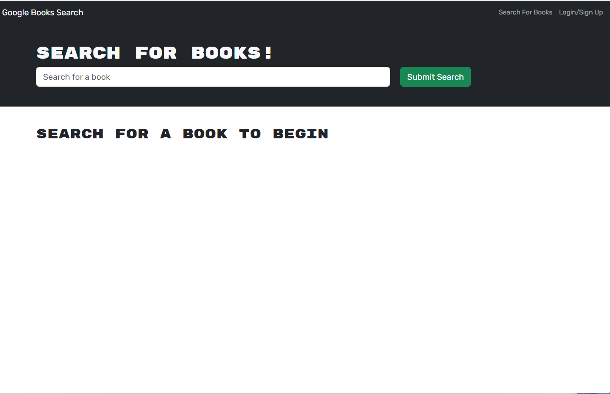

# MERN-Stack-Book-Engine

## Table of Contents
- [Description](#description)
- [Technology](#technology)
- [Installation](#installation)
- [Features](#features)
- [License](#license)
- [Contribution](#contribution)
- [Questions](#questions)

### Description
This app is a user-friendly, web-based application that empowers book lovers to create and manage their personal libraries with ease. With a clean and intuitive interface, users can register, log in, and instantly start building their digital bookshelf.

### Technologies

Node.js, Express.js, React, Vite, Heroku, MongoDb

### Installation

1. Clone this repository to your local machine.
2. Navigate to the project directory
3. Run the following commands in your terminal
```sh
npm install
npm run develop
```
4. Open your browser and visit `http://localhost:3000` to see the portfolio in action.

### Features
* User Authentication
* Book Management
* Integration with an External API (googlebooks)
* MongoDb Database
* Backend (Node.js and Express.js)
* Frontend (React)

## Heroku Deployment

https://immense-oasis-12077-e4ded8d7c75c.herokuapp.com/

## ScreenShot



### License

[](LICENSE)

### Questions

If you have any questions feel free to contact me via email: robertcoulson91@gmail.com 
You can also view more of my projects at https://github.com/RobertC91.
